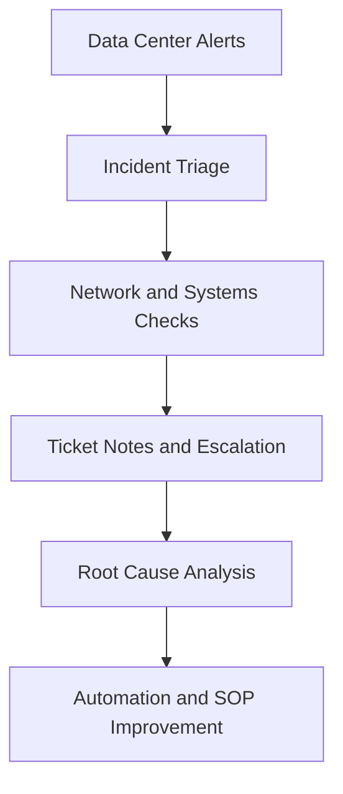

<div align="center">

<h1>Kishore Vallamreddy</h1>

<h3>Data Center Operations Technician | Critical Facilities | Network and Infrastructure Support | AI Automation</h3>

[](https://git.io/typing-svg)

<br>

[](https://www.linkedin.com/in/kishorevreddy156)
[](mailto:kish.vlreddy@gmail.com)
[](https://github.com/kish1562)
[](https://github.com/kish1562)

</div>

---

<div align="center">

[](#mission-control)
[](#project-grid)
[](#technical-radar)
[](#github-signal)

</div>

---

## Mission Control

I build and support the systems behind reliable infrastructure: **data center operations**, **network troubleshooting**, **incident response**, **technical documentation**, and **automation**.

My profile connects hands-on infrastructure support with modern AI and cloud side projects. That means I can work in the physical operations world of racks, alerts, tickets, assets, and uptime, while also building scripts and tools that make operations faster, cleaner, and more repeatable.

```text
Current Direction
Data Center Operations Technician
Critical Facilities Technician
Data Center Infrastructure Technician
Network Operations Technician
Infrastructure Support Technician
```

---

## Operations Command Stack

<div align="center">

| Critical Facilities | Network Operations | Systems Support | Automation |
|---|---|---|---|
| BMS | TCP/IP | Windows Server | Python |
| EPMS | DNS | Linux | Bash |
| UPS | DHCP | Active Directory | SQL |
| PDU | VLAN | VMware | Azure |
| CRAC and CRAH | VPN | Microsoft 365 | GitHub Actions |
| Environmental Monitoring | Incident Response | Asset Tracking | Documentation |

</div>

---

## Technical Radar

<div align="center">


</div>

---

## Project Grid

<table>
  <tr>
    <td width="50%">
      <h3>AI Agent for Lead Generation</h3>
      <p><a href="https://github.com/kish1562/ai-agent-lead-gen.git">Open repository</a></p>
      <p>Agentic AI workflow using LangGraph, Azure AI Foundry, RAG, and MCP-style integrations for enterprise automation.</p>
      <p><b>Infrastructure value:</b> workflow automation, API integration, logging, system documentation, and repeatable operations.</p>
    </td>
    <td width="50%">
      <h3>Azure Data Pipeline Medallion Architecture</h3>
      <p><a href="https://github.com/kish1562/azure-data-pipeline-medallion.git">Open repository</a></p>
      <p>Azure Data Factory, Databricks, Synapse, ADLS Gen2, Delta Lake, Python, PySpark, and SQL.</p>
      <p><b>Infrastructure value:</b> reliability, monitoring, data flow, troubleshooting, and production pipeline operations.</p>
    </td>
  </tr>
  <tr>
    <td width="50%">
      <h3>Data Quality and ETL Automation</h3>
      <p><a href="https://github.com/kish1562">Open GitHub projects</a></p>
      <p>Automation workflows for validation, reporting, transformation, and quality checks using Python, SQL, dashboards, and cloud tools.</p>
      <p><b>Infrastructure value:</b> scripting, log review, repeatable checks, reporting, and documentation.</p>
    </td>
    <td width="50%">
      <h3>Data Center Lab Roadmap</h3>
      <p>Building labs for Linux monitoring, network troubleshooting, asset tracking, incident response, and Windows Server administration.</p>
      <p><b>Infrastructure value:</b> data center readiness, SOP thinking, ticket-quality notes, and technician-level troubleshooting.</p>
    </td>
  </tr>
</table>

---

## Data Center Lab Roadmap

| Lab | What It Shows | Status |
|---|---|---|
| Linux Server Monitoring | CPU, memory, disk, uptime, service checks, logs | Building |
| Network Troubleshooting Notes | DNS, DHCP, VLAN, VPN, ping, traceroute, nslookup, dig | Building |
| Data Center Asset Tracker | Hostname, serial, rack, IP, owner, status, lifecycle | Building |
| Incident Response Runbook | Alert triage, escalation, RCA, SLA notes, ticket quality | Building |
| Windows Server Admin Labs | Active Directory, users, groups, DNS, DHCP, access checks | Building |

---

## AI Era Infrastructure Mindset



I am interested in the next generation of operations work: technicians who understand physical infrastructure, cloud systems, networks, monitoring, and AI-assisted automation.

---

## GitHub Signal


</div>

---

## Recruiter Keywords

`Data Center Operations` `Critical Facilities` `Mission Critical` `Network Troubleshooting` `Incident Response` `Rack and Stack` `Server Installation` `BMS` `EPMS` `UPS` `PDU` `CRAC` `CRAH` `Linux` `Windows Server` `Active Directory` `DNS` `DHCP` `VLAN` `Python` `Bash` `Azure`

---

<div align="center">

<h3>Open to Data Center Operations, Critical Facilities, Network Operations, and Infrastructure Support roles.</h3>

</div>
